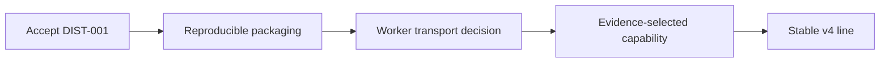

# Arcturus delivery roadmap

This roadmap contains approved outcomes and principal gates. It is not a
feature inventory, a detailed future contract, or a live status page.

## 1. Accept DIST-001

**Outcome:** Deploy one existing release to either of two heterogeneous
AlmaLinux workers, recover it after a container failure, use imported Redis
through RESP, and move it target-first without changing the application.

**Gate:** Complete the [physical runbook](slices/DIST-001/runbook.md), append
immutable evidence, and receive an owner verdict.

## 2. Make installation reproducible

**Outcome:** Publish verified multi-architecture Arcturus bundles and prove the
central path resolver across rootless, appliance, and RPM-style layouts.

**Gate:** Clean arm64/amd64 install, update, reboot, rollback, and path-migration
evidence without repository-relative execution or package ownership of mutable
state.

This outcome may provide the bundle needed by DIST-001 but cannot change its
fleet contract.

## 3. Decide and prove worker transport

**Outcome:** Retain worker-initiated communication and durable desired-state
semantics while reducing operational security burden.

**Gate:** Compare the existing JSON/HTTP path with a worker-initiated
gRPC/HTTP2 channel and explicit encrypted-transport options, then approve one
enrollment, identity, disconnection, debugging, and upgrade model.

Arcturus will not silently become a mesh VPN, NAT-traversal service, or general
certificate authority.

## 4. Select one operational capability

Choose the next owner-visible outcome from evidence gathered while operating
the accepted fleet. Candidate areas are heterogeneous placement, safe stateful
movement, one managed resource, protection and restore, or operational
observability. Selection does not freeze a schema or authorize a generalized
framework.

## 5. Reach a stable v4 line

**Outcome:** Declare a stable distributed product line without changing the v2
manifest merely for the product version.

**Gate:** Accepted lifecycle, fleet, installation, update, security, recovery,
compatibility, and documentation evidence, with explicit removal windows for
deprecated paths.

Historical pre-v4 sequencing remains in the [archived
roadmap](archive/roadmap-pre-v4.md).
