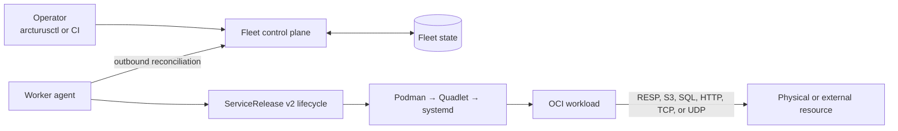
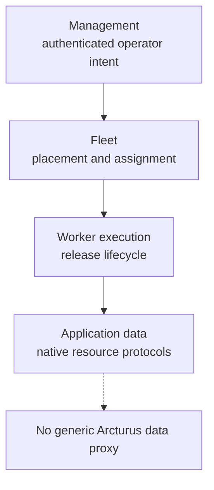
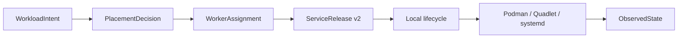
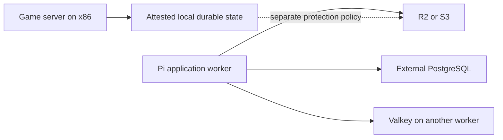

# Arcturus architecture

Arcturus is a distributed application and infrastructure platform built around
an established host-local Podman, Quadlet, and systemd lifecycle. This page
owns the system-wide boundaries; subsystem documents own their detailed
contracts, and [Status](status.md) owns no architecture at all.

## System topology

Operators submit desired state to a persistent control plane. Workers pull
assignments and apply them locally. Application traffic goes directly to its
resources instead of through Arcturus.

The control plane owns durable intent and placement decisions. Operator
clients are transient. Git may store desired configuration or trigger
automation, but it does not execute or reconcile workloads.

## Ownership planes

- Management accepts and explains operator intent.
- Fleet state records workers, resources, decisions, assignments, and
  observations.
- Worker execution mutates only the local host through the existing lifecycle.
- Applications and providers retain their native data protocols and semantics.

## Release boundary

The distributed layer wraps one complete `ServiceRelease v2`. It does not
redefine that release or split its components across workers.

Existing local services remain independent until an operator explicitly
adopts them into fleet intent.

## Hybrid infrastructure

Compute and resource placement are separate. A Pi may use an external database
or object store; an x86 worker may host a latency-sensitive resource; moving
stateless compute need not move its data.

Arcturus models identity, lifecycle ownership, binding, and placement
requirements. It does not pretend that Redis, PostgreSQL, S3, D1, Turso, and
Firebase are interchangeable.

## Invariants

- Applications remain ordinary OCI workloads.
- `ServiceRelease v2` is the atomic worker-local lifecycle and rollback unit.
- Workers initiate fleet communication and mutate only their own hosts.
- Only explicit desired state removes a fleet-managed workload.
- One workload's failure does not disturb unrelated workloads.
- Compute placement does not imply resource placement.
- Measured hardware facts and operator attestations remain distinct.
- Backup, replication, redundancy, failover, and cache reconstruction are
  separate concerns.

See [Distributed fleet](distributed-fleet.md), [Resources and
persistence](resources-and-persistence.md), [Security](security.md), and
[Filesystem layout](filesystem-layout.md) for the owning subsystem contracts.
