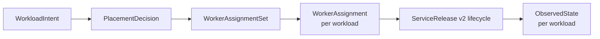
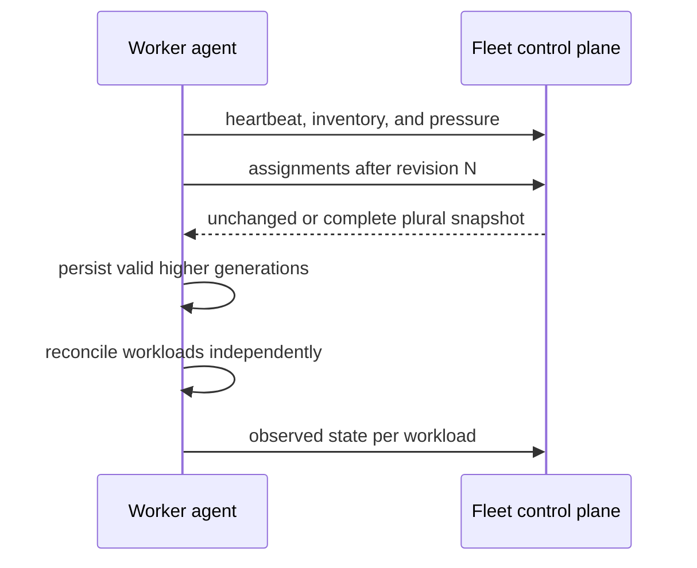
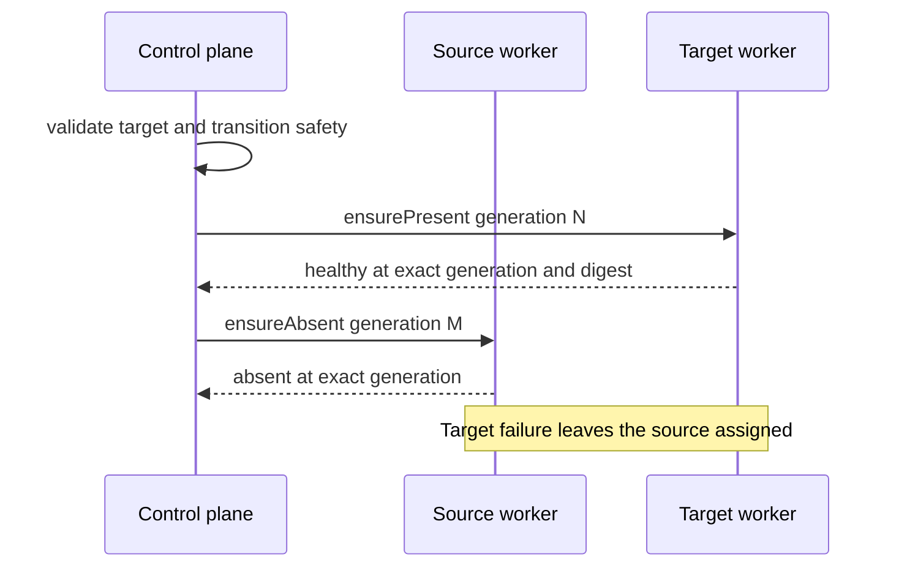

# Distributed fleet

The fleet layer places complete releases on workers and delegates execution to
the existing host-local lifecycle. It owns desired state and placement; it does
not replace release validation, Podman, Quadlet, systemd, or application
protocols.

## Desired and observed state

- **WorkloadIntent** contains one complete release, placement requirements,
  resource bindings, transition policy, derived characteristics, and canonical
  release digest.
- **PlacementDecision** records the selected worker or stable refusal reasons
  for every candidate.
- **WorkerAssignment** is keyed by worker and workload, has an independent
  generation, and explicitly says `ensurePresent` or `ensureAbsent`.
- **WorkerAssignmentSet** is a revisioned complete snapshot for one worker.
- **ObservedState** reports the accepted generation, active release, systemd
  state, routing state, and structured failure for one workload.

A worker can reconcile many assignments. One workload's invalid input, failed
credential, retry, or conflict cannot change another workload's generation or
observation.

## Worker reconciliation

Workers initiate all fleet communication and require no inbound listener or
public address.

The worker persists an assignment before mutation and retains cached desired
state through control-plane outages. Snapshot omission has no removal meaning.
Only explicit `ensureAbsent` authorizes removal. Tombstones remain
authoritative until a future collector has durable acknowledgement of the
matching absence generation.

## Placement

Placement first applies hard eligibility:

- explicit worker identity or normalized OCI architecture;
- required total or available memory;
- required operator-attested capabilities; and
- required topology labels.

Inventory, live pressure, and operator attestations are separate authorities.
Device names never imply durability or topology. Live pressure may reject a new
target but cannot evict, move, or withdraw an already-running workload.

An explicit target still passes every hard requirement. Architecture-based
selection retains an eligible current worker; otherwise it chooses
deterministically among eligible workers. Refusal reasons remain available to
operators.

## Movement

Movement is serialized per workload and fails closed. It evaluates movability,
overlap safety, authoritative-state locality, migration, and fencing
independently.

Target-first overlap is permitted only when the release and bound resources
establish that it is safe. Unknown, node-local, migration-dependent, or
fencing-dependent cases remain refused until a concrete transition strategy
exists.

## Boundaries

- `ServiceRelease v2` remains the worker-local lifecycle and rollback unit.
- Existing local services are not adopted without explicit fleet intent.
- Resource identity remains independent of a release; see [Resources and
  persistence](resources-and-persistence.md).
- Operators use `arcturusctl` for enrollment, resources, apply, status,
  refusal explanation, and movement; see [Operations](operations.md).
- Fleet and worker state use the central [filesystem
  contract](filesystem-layout.md).

Current gates and verdicts live in [Delivery status](status.md), not here.

