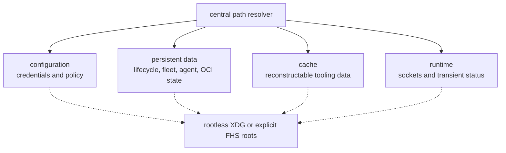

# Filesystem layout

Arcturus `v4.0.0-alpha.1` uses one filesystem contract across Python, Rust,
Node, the host installer, updater, command wrappers, SD-card provisioner, and
generated user-systemd units. It is nicknamed “Four Roots” because
configuration, persistent data, reconstructable cache, and runtime files are
resolved independently.

The resolver chooses each root once; individual modules consume resolved
paths instead of rebuilding `$HOME` assumptions.



## Rootless defaults

| Root | Selection order | Arcturus directory |
| --- | --- | --- |
| Configuration | `ARCTURUS_CONFIG_ROOT`, `XDG_CONFIG_HOME`, `$HOME/.config` | `<root>/arcturus` |
| Persistent data | `ARCTURUS_DATA_ROOT`, `XDG_DATA_HOME`, `$HOME/.local/share` | component-specific `arcturus-*` directories |
| Cache | `ARCTURUS_CACHE_ROOT`, `XDG_CACHE_HOME`, `$HOME/.cache` | `<root>/arcturus` |
| Runtime | `ARCTURUS_RUNTIME_ROOT`, `XDG_RUNTIME_DIR`, `/run/user/$UID` | `<root>/arcturus` |

The persistent-data root contains separate `arcturus-deployer`,
`arcturus-fleet`, `arcturus-agent`, `arcturus-oci-auth`, and
`arcturus-registry` directories. This separation is intentional: their
databases and lifecycle responsibilities are independent.

User units use `<config-root>/systemd/user`; Quadlets use
`<config-root>/containers/systemd/arcturus`. Executables default to
`$HOME/.local/bin`. The legacy/source workload tree defaults to `$HOME/stacks`
and is not classified as XDG application state.

Inspect the effective layout without changing anything:

```bash
deploy/arcturus_paths.py
deploy/arcturus_paths.py --format shell
deploy/arcturus_paths.py --get fleet_state_dir
```

## Overrides

Use the four `_ROOT` variables or matching installer options when selecting a
layout. The installer records and replays them.

```bash
./deploy/install-host.sh \
  --config-root /srv/arcturus/config \
  --data-root /srv/arcturus/data \
  --cache-root /srv/arcturus/cache \
  --runtime-root /run/user/1001 \
  --bin-dir /srv/arcturus/bin \
  --workload-root /srv/arcturus/workloads \
  [other options]
```

Final-directory compatibility overrides such as `ARCTURUS_STATE_DIR`,
`ARCTURUS_FLEET_STATE_DIR`, `ARCTURUS_AGENT_STATE_DIR`,
`ARCTURUS_CONFIG_DIR`, `ARCTURUS_RUNTIME_DIR`, `ARCTURUS_SYSTEMD_DIR`, and
`ARCTURUS_QUADLET_DIR` remain supported. Prefer roots for a new installation;
use final overrides only when preserving an established exceptional layout.

All paths must be absolute. The installer currently rejects whitespace in
managed paths because its environment files must remain unambiguous.

## Existing-host migration

Changing a root does not copy data. The installed updater remembers its exact
layout and refuses to abandon recorded configuration or update history during
a custom-root change. The installer also detects state in the historical
rootless defaults and fails when the selected target does not contain the
corresponding marker. These checks prevent common cases of an existing
deployment starting with an empty database; operators must still inventory all
custom directories before a manual migration.

Perform a non-destructive migration in a maintenance window:

1. Record the current and proposed output of `arcturus_paths.py`.
2. Stop the Arcturus user units, including `arcturus-agent` and `arcturusd`
   when enabled. Do not copy a live SQLite database or mutable registry tree.
3. Copy configuration and each persistent-data directory that is changing,
   preserving ownership, permissions, links, extended attributes, and SELinux
   labels appropriate for the destination.
4. Keep the source directories intact as rollback material.
5. Set the new roots and run installer validation, then a dry run.
6. Apply the installer, inspect its generated units and environment files,
   start the services, and verify lifecycle plus fleet desired/observed state.
7. Remove old copies only under a separate, explicit retention decision.

There is deliberately no automatic migration flag: the correct copy and
labeling operation depends on whether the target is a rootless user layout, a
system image, or future RPM-managed installation.

## FHS and RPM direction

The same resolver can describe a system layout, for example configuration
under `/etc/arcturus`, persistent state under `/var/lib/arcturus-*`, cache
under `/var/cache/arcturus`, runtime files under `/run/arcturus`, binaries in
`/usr/bin`, and workloads under an operator-selected `/srv` location.

This is a path-contract and source-relocatability guarantee, not a claim that
an RPM or privileged system service exists today. The current installer is a
rootless user-systemd installer and must have permission to create every
selected location. A future RPM should own immutable binaries, templates, and
documentation, but must not own or silently delete operator configuration,
credentials, databases, application volumes, or registry content.

## Cache boundary

Podman's content-addressed OCI layer store remains the workload artifact
cache. Arcturus adds no competing image cache and does not prune Podman storage
automatically. The Arcturus cache directory is reserved for reconstructable
tooling artifacts such as verified downloaded installation images; it must not
contain authoritative application state.
