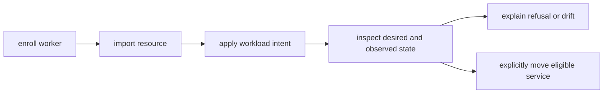

# Operations

Arcturus records deployment and lifecycle operations in its state database, but systemd and journald remain the runtime authorities.

## Authentication environment

```bash
export ARCTURUS_API_URL='http://127.0.0.1:9090'
config_dir="$(arcturus_paths.py --get config_dir)"
export ARCTURUS_TOKEN_FILE="$config_dir/my-api.token"
```

The CLI also accepts `ARCTURUS_DEPLOY_TOKEN` for CI compatibility. Prefer a protected token file for interactive use.

Before an expensive build, validate that the API is ready and that the token is scoped to the project service:

```bash
arcturusctl project preflight .arcturus/project.json \
  --token-file "$ARCTURUS_TOKEN_FILE"
```

The preflight also verifies every Podman secret and every external named volume/network referenced by the release template. It does not expose secret values.

## Fleet operations

Fleet management uses a distinct operator audience and endpoint. A
fleet-operator credential cannot deploy a service through the host-local
lifecycle API:



This is the normal management path. Operators should not hand-edit fleet
SQLite or use raw HTTP for routine work.

```bash
arcturusctl token create \
  --database "$config_dir/fleet-tokens.json" \
  --fleet-operator \
  --token-id fleet-operator \
  --output "$config_dir/fleet-operator.token"

export ARCTURUS_FLEET_API_URL='http://127.0.0.1:9190'
export ARCTURUS_FLEET_TOKEN_FILE="$config_dir/fleet-operator.token"
```

Enroll and inspect workers without editing fleet state directly:

```bash
arcturusctl fleet worker enroll edge-arm64 \
  --capability durable-storage \
  --topology site=edge-a \
  --credential-output ./edge-arm64.worker-token
arcturusctl fleet worker list
```

The credential is returned once and the output file is created with mode
`0600`. Transfer it only to the named worker. Capability and topology values are
operator attestations. The initial agent heartbeat measures architecture,
operating system, logical CPU count, total/available memory, and ordering; it
does not yet discover or classify storage, CPU utilization, or thermal state.

Import an existing external resource and apply a workload intent:

```bash
arcturusctl fleet resource import ./imported-resource.json
arcturusctl fleet service apply ./workload-intent.json
arcturusctl fleet service list
```

`fleet service apply` validates the embedded `ServiceRelease v2` with the
authoritative Python/Pydantic model, derives its placement characteristics, and
submits the canonical digest. It does not provision the imported resource or
store credential values.

Inspect the desired intent, decision, assignments, movement phase, and actual
worker observations:

```bash
arcturusctl fleet service status my-service
arcturusctl fleet service explain my-service
```

`explain` provides candidate-specific hard refusal codes for heartbeat,
inventory, architecture, memory, pressure at admission time, capability,
topology, resource prerequisites, transition safety, and same-target requests.
Pressure changes after admission are diagnostic only and never trigger
automatic eviction or movement in DIST-001.

Move an eligible overlap-safe service explicitly using optimistic generation
control:

```bash
arcturusctl fleet service move my-service \
  --worker-id edge-amd64 \
  --expected-generation 1
```

The source remains `ensurePresent` until the target reports `healthy` for the
exact target assignment generation and release digest. Target failure leaves
the source running. Stateful, overlap-unsafe, migration-dependent,
fencing-dependent, and unknown transitions are refused. An `ensureAbsent`
tombstone remains authoritative after removal; snapshot absence never means
stop.

See [Distributed fleet foundation](distributed-fleet.md) for the complete
current behavior and [DIST-001 physical runbook](slices/DIST-001/runbook.md)
for the pending two-worker evidence procedure.

## Validate and preview

```bash
arcturusctl validate arcturus.release.json
arcturusctl render \
  --template arcturus.release.template.json \
  --service my-api \
  --revision '<40-char-sha>' \
  --image 'api=registry.example.org/team/my-api@sha256:<digest>' \
  --output arcturus.release.json \
  --request-output deployment-request.json
arcturusctl preview arcturus.release.json --output /tmp/arcturus-render
```

Project-aware commands can validate the build graph and release template together:

```bash
arcturusctl project validate .arcturus/project.json
arcturusctl project plan .arcturus/project.json
```

## Deploy and verify

```bash
arcturusctl deploy deployment-request.json \
  --api-url "$ARCTURUS_API_URL"

arcturusctl status my-api --api-url "$ARCTURUS_API_URL"
arcturusctl verify my-api --api-url "$ARCTURUS_API_URL"
```

A successful HTTP response is not sufficient by itself; automation must also require the returned operation/release status to be successful and verify the expected revision and digests.

## Runtime status and logs

```bash
systemctl --user status arcturus-my-api.target
systemctl --user list-units 'arcturus-my-api-*'
journalctl --user -u 'arcturus-my-api-*' --since today
podman ps --filter label=io.containers.autoupdate=disabled
```

For scheduled components:

```bash
systemctl --user list-timers 'arcturus-my-api-*'
journalctl --user -u 'arcturus-my-api-*.service' --since today
```

## Rollback

Roll back to the previous eligible release:

```bash
arcturusctl rollback my-api --api-url "$ARCTURUS_API_URL"
```

Or select a known deployment ID using the CLI's `--deployment-id` option. Verify the active revision, image digests, health, and routing receipt after rollback.

A deployment failure with successful automatic rollback is still a failed deployment. Preserve both the failure record and the restored release identity.

## Disable and enable

```bash
arcturusctl disable my-api --api-url "$ARCTURUS_API_URL"
arcturusctl enable my-api --api-url "$ARCTURUS_API_URL"
```

Disable stops runtime ownership and withdraws active routing publication while retaining the release and data. Enable reactivates the selected release and re-runs readiness checks.

## Remove

```bash
arcturusctl remove my-api --api-url "$ARCTURUS_API_URL"
```

Remove stops and removes generated active ownership. It intentionally preserves:

- release archives
- audit and operation records
- bind-mounted data
- named volumes
- Podman secrets

Delete data only through a separate, reviewed storage operation.

## Token rotation

Create a replacement token before revoking the old one:

```bash
umask 077
arcturusctl token create \
  --database "$config_dir/tokens.json" \
  --service my-api \
  --token-id my-api-ci-2026-02 \
  --output "$config_dir/my-api-ci-2026-02.token"
```

Update CI, verify a deployment or status call, then revoke the previous token ID.

The plaintext token exists only in the output file. Store its contents as the protected CI secret `ARCTURUS_DEPLOY_TOKEN`; do not commit the file or the token database.

## Common failures

### Manifest rejected

Run local validation and check for floating image tags, secret-like environment keys, invalid references, cycles, undeclared networks, invalid schedules, or host bind paths outside the allowlist.

### Image pull or inspect failed

Verify the service account's pull-only registry login and test the exact digest-pinned image with rootless Podman.

### Unit did not become ready

Inspect the generated target and component journals. For health-checked services, inspect Podman health output. For one-shots, verify the command exits zero and is safe to rerun.

### Deployment API returned HTTP 502

When the response body contains `status: failed`, the request was authenticated and reached the release engine. Arcturus uses HTTP 502 when activation failed but rollback succeeded. This is not a missing API key. Read the returned `error.message` and `rollback` object, then inspect:

```bash
systemctl --user status 'arcturus-deployer@*'
journalctl --user -u 'arcturus-deployer@*' -n 200 --no-pager
journalctl --user -u 'arcturus-<service>-*' -n 300 --no-pager
```

### Router receipt missing or stale

Check the active manifest, registry and router services, router status file, generated vhost, nginx test/reload logs, and whether the service joins the routing network.

### Rootless services disappear after reboot

Verify lingering, the user manager, the dedicated Podman API unit, the active service targets/timers, and required external networks. Do not treat an aggregate compatibility unit as authoritative when individual units are healthy.

### Worker is stale or has no inventory

Check `arcturus-agent.service`, its journal, the configured control-plane URL,
the protected worker credential, and encrypted network reachability. The
control plane uses server receipt time for liveness; changing the worker clock
does not make a heartbeat fresh.

### One fleet workload will not reconcile

Inspect that workload's observation and the agent journal. Confirm that
`<config-root>/arcturus/lifecycle-tokens/<service>.token` exists with mode `0600`
and has the matching service scope. Do not replace it with a broad fleet token.
Other cached workloads should continue reconciling independently.

### Fleet control plane is unavailable

New placement and movement decisions stop, but the agent continues reconciling
durably cached assignments and must not withdraw healthy services. Restore the
control plane and verify that assignment-set revision, per-workload generation,
and observations resume without an implicit removal.
