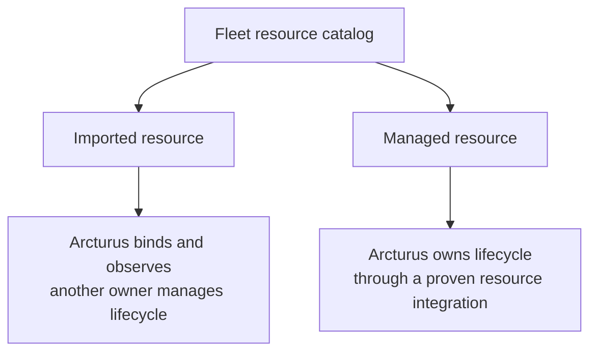
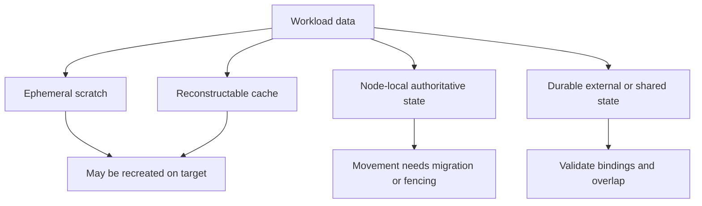
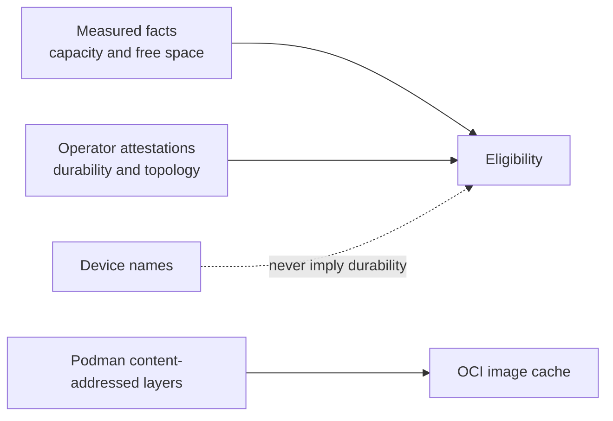

# Resources and persistence

Arcturus separates application compute from the infrastructure it consumes.
Resources have fleet identity independent of a release, while applications
continue using each resource's native protocol.

## Binding

The fleet catalog stores resource identity and material references, not secret
values. A worker projects protected material through secrets already declared
by the release. Arcturus does not proxy RESP, SQL, S3, or other application
data protocols.

Podman `external` volumes and networks retain their existing meaning:
pre-existing host-local objects. They are not fleet ownership markers.

## Lifecycle ownership

Imported and managed describe lifecycle ownership, not location. Managed
resources are added one concrete lifecycle at a time; the catalog does not
justify a generic provider framework by itself.

## Persistence and movement

Storage implementation does not establish whether movement is safe. The
authority and loss semantics of the data matter.

Target-first movement requires explicit safe overlap, no unresolved local
authority, and no unmet migration or fencing requirement. Unknown information
fails closed.

Backup remains separate from ownership and availability. A managed database
may back up to object storage, a game-world volume may snapshot off-site, and a
reconstructable cache may need no backup. A backup is not automatically a
replica or failover target.

## Worker knowledge

Measured facts, live pressure, and operator claims remain separate. Podman's
digest-verified layer storage is the workload image cache; an additional
Arcturus cache requires a concrete need.

