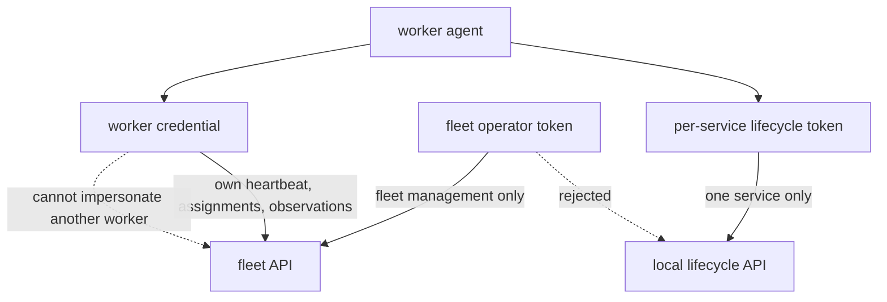

# Security model

Arcturus is a deployment control plane. A party that can modify a trusted application manifest or use a valid deployment token can run that service's containers and request allowed host mounts. Security therefore depends on repository governance, service-scoped credentials, host isolation, and immutable release inputs.

## Supported security properties

- Rootless Podman for application and control-plane containers
- Fully qualified image digests; floating tags are rejected
- Service-scoped deployment tokens stored as salted scrypt verifiers
- Per-service operation locks
- Manifest schema with unknown-field rejection
- Secret-like environment keys rejected in favor of Podman secret references
- Bind mounts restricted to configured host roots
- Generated release archives and atomic active selection
- Health-gated activation and automatic rollback
- Structured output redaction for authorization, token, password, secret, API-key, and registry-auth fields
- Safe router input validation and configuration restoration after failed nginx validation/reload
- Fleet-operator credentials separated from service lifecycle scope
- Worker credentials hashed in fleet state and restricted to one worker identity
- Protected per-service lifecycle credentials on each worker instead of one fleet-wide deployment token
- Outbound-only fleet communication from workers

## Deployment API exposure

Keep the API on loopback whenever CI runs on the host. Remote listeners must use a private address, source-scoped firewall access, and token authentication. Never publish the API directly to the internet through the public ingress.

One token should identify one service and one CI purpose. Do not share a global bearer token across repositories.

## Fleet authentication

Fleet management, worker communication, and local lifecycle execution are
separate authorization boundaries:

The arrows show both network direction and credential scope. The worker opens
the fleet connection, but uses a different per-service credential when it
calls its own host-local lifecycle API.

- A `fleet-operator` token can enroll workers and manage resources, workload
  intent, placement, and movement. It has an empty lifecycle service scope and
  is rejected by deployment endpoints.
- A worker credential is generated once at enrollment. The fleet database keeps
  only its salted hash, and the credential is accepted only for that worker's
  heartbeat, assignment polling, and per-workload observation endpoints.
- The agent reads one protected lifecycle token per service from
  `<config-root>/arcturus/lifecycle-tokens/`. Missing or invalid authority fails
  only that workload; no generic credential lets a worker deploy every service.

Worker credentials are long-lived bearer secrets. Protect credential files with
mode `0600`, transfer them only to the enrolled worker, and use HTTPS or an
already authenticated encrypted private transport. Workers initiate all fleet
connections and should not expose an inbound agent port.

The current Rust control plane has one listener. The installer refuses a
non-loopback fleet listener combined with OCI authorization until those
surfaces can use separate listeners. Do not weaken the established loopback
OCI boundary to combine roles.

## Registry credentials

Use separate credentials:

- CI: push permission limited to the required repositories
- Host: pull-only permission

Pass passwords through stdin into protected auth files. Do not place registry credentials in image references, manifests, Git remotes, workflow arguments, or uploaded artifacts.

## Removable-media bootstrap

The [Raspberry Pi SD-card provisioner](raspberry-pi-provisioning.md) writes only
the selected SSH **public** key, but it must also stage the enrolled worker
credential and any explicitly supplied service lifecycle or target pull
credentials. Treat a prepared card as sensitive until first boot completes.
The first-boot script removes the live bootstrap files after successful
installation, but deletion from flash media is not secure erasure. Revoke or
rotate credentials if a prepared card is lost, duplicated, or leaves the
trusted provisioning path.

Bundle-extraction and target pull credentials are separate inputs. A credential
used by Podman on the provisioning workstation is not copied to the worker;
target registry access must be deliberately provided as its own pull-only file.
The provisioner never copies an SSH private key.

## Runtime secrets

Provision application secrets on the rootless host with Podman secrets. Manifests contain only the secret name, delivery type, and target.

Fleet resource records and bindings contain resource identity, protocol or
capability identifiers, and secret material references—not credential values.
Imported Redis, SQL, S3, and other resources remain native data-plane
connections from the application; the fleet API is not a credential or data
proxy.

Use versioned secret names for rotation. Keep the prior secret usable until rollback to the previous healthy release has been tested. Deployment and removal do not delete secrets.

## Host filesystem

Bind mounts are allowed only beneath configured roots. Keep control-plane state, token databases, registry auth, and systemd credentials outside application repositories with mode `0600` where appropriate.

Fleet and agent SQLite directories use protected permissions. Their rootless
defaults are under `${XDG_DATA_HOME:-~/.local/share}`; configuration and
credentials default under `${XDG_CONFIG_HOME:-~/.config}`. FHS-style overrides
must use the centralized path resolver rather than module-specific home paths.

Generated Quadlets and unit files are build artifacts. Host customization belongs in reviewed systemd drop-ins, not direct edits to active release files.

## CI runners

The service blueprint uses Buildah storage isolated to the current job. A normal workflow does not need a privileged container or the production host Podman socket. Treat runner registration tokens and generated runner state as secrets.

## Ingress and apex ownership

The router validates DNS names, aliases, ports, runtime identifiers, redirect targets, and bounded nginx values. No service may claim the configured base-domain apex unless `ARCTURUS_APEX_SERVICE` explicitly names it.

Ingress is operator-owned. TLS keys, ACME credentials, Cloudflare tokens, generated vhosts, and runtime logs must not be committed to the platform repository.

## Legacy compatibility risk

The deprecated `/deploy` endpoint, Terraform local provisioners, mutable host Git checkouts, Compose ownership, Watchtower, and broad runner socket access have a larger trust surface than the current release path. The installer preserves old shared webhook authentication for compatibility, but immutable full-SHA applies are the default. Use `--allow-legacy-mutable-main` only as a time-bounded bridge for an unchanged 0.99.x workflow, then rerun the installer with `--disallow-legacy-mutable-main` after CI sends the exact commit. Keep the legacy path isolated and remove it after no production workflow depends on it.

## Release security checks

Before publication or release:

- scan the full public history for secrets
- inspect the exact `git archive` output
- confirm no environment files, credentials, runtime databases, logs, generated vhosts, certificates, private inventory, or runner state are tracked
- run application tests and dependency audits
- verify GitHub workflows from a clean clone
- push only intended branches and tags

See [Release process](release-process.md) and [SECURITY.md](../SECURITY.md).
