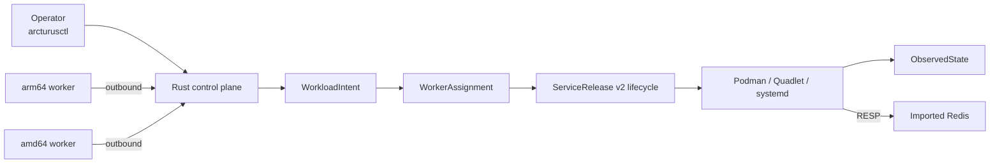

# DIST-001: Distributed fleet foundation

DIST-001 adds fleet placement around the existing worker-local lifecycle. Its
source implementation is complete; the manifest owns the remaining gate and
owner verdict.

## System path

The contract has no architectural limit of two workers or one workload. The
physical gate deliberately uses two workers and one workload without making a
scalability claim.

The stable reconciliation, tombstone, outage, placement, and target-first
movement semantics are explained once in
[Distributed fleet](../../distributed-fleet.md). The approved contract below
owns the DIST-001 requirements; this overview does not restate them.

## Records

- [Approved contract](contract-v1alpha1.md)
- [Physical runbook](runbook.md)
- [Source implementation evidence](evidence/source-implementation.md)
- [Machine-readable state](manifest.yaml)
