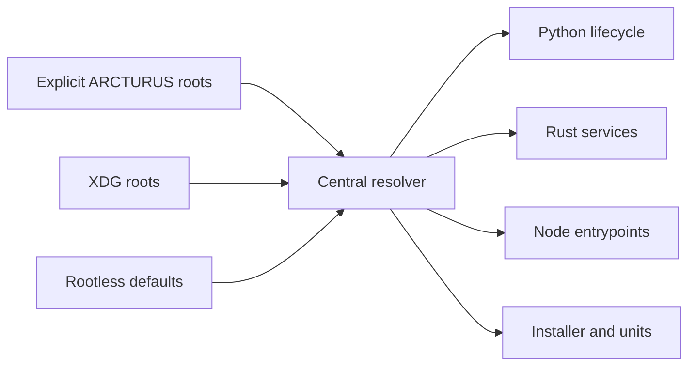

# PATH-001: Four-root filesystem transition

Arcturus now resolves configuration, persistent data, reconstructable cache,
and runtime paths through one cross-language contract.

The transition preserves ordinary rootless defaults and refuses silent state
abandonment. It enables—but does not yet prove—RPM and system-service layouts.

- [Filesystem contract](../../filesystem-layout.md)
- [Source implementation evidence](evidence/source-implementation.md)
- [Machine-readable state](manifest.yaml)

